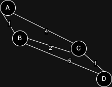

# PROVAS
## Calendário
|Matéria|Atividade|Data|
|-|-|-|
|Estrutura de Dados|P4|03/06/2024|

## P4
### Tema: Algoritmo de Dijkstra

O trabalho deverá ser desenvolvido em grupos com no máximo 2 pessoas (quem ficar sozinho me procure), e deverá possuir as seguintes características:

    1) Cada trio deverá escolher o tema abaixo e postar no grupo da disciplina: o tema escolhido e os nomes dos integrantes do grupo (apenas 1 integrante posta essa informação)
    
    2) A apresentação do trabalho será presencial na data marcada abaixo no Sigaa. Não serão aceitas apresentações via EaD.

    3) A apresentação deverá conter obrigatoriamente: a descrição do algorimto em grafo escolhido; a explicação do funcionamento; onde o algoritmo foi/é utilizado; qual o problema que tal algoritmo resolve; e um exemplo do algoritmo rodando.

    4) Todos os integrantes da dupla deverão participar da apresentação.

    5) o trabalho valerá de 0 a 10 pontos e será contabilizado como 3 nota da disciplina.

    6) Deverá ser utilizado o crédito a distância da disciplina para fazer o trabalho.

[Algorítmo usado na apresentação](P4/fila_de_prioridade.js)

[Grafo usado na apresentação](P4/grafo.drawio)

### Algorítimo
```javascript
class ListaDePrioridade {
  constructor() {
    this.heap = [];
  }

  parentIndex(index) {
    return Math.floor((index - 1) / 2);
  }

  leftChildIndex(index) {
    return 2 * index + 1;
  }

  rightChildIndex(index) {
    return 2 * index + 2;
  }

  swap(index1, index2) {
    [this.heap[index1], this.heap[index2]] = [
      this.heap[index2],
      this.heap[index1],
    ];
  }

  insert(element) {
    this.heap.push(element);
    this.heapifyUp();
  }

  heapifyUp() {
    let index = this.heap.length - 1;
    while (
      index > 0 &&
      this.heap[index].priority < this.heap[this.parentIndex(index)].priority
    ) {
      this.swap(index, this.parentIndex(index));
      index = this.parentIndex(index);
    }
  }

  extractMin() {
    if (this.heap.length === 0) {
      throw new Error("Heap is empty");
    }
    if (this.heap.length === 1) {
      return this.heap.pop();
    }
    const min = this.heap[0];
    this.heap[0] = this.heap.pop();
    this.heapifyDown();
    return min;
  }

  heapifyDown() {
    let index = 0;
    while (this.leftChildIndex(index) < this.heap.length) {
      let smallerChildIndex = this.leftChildIndex(index);
      if (
        this.rightChildIndex(index) < this.heap.length &&
        this.heap[this.rightChildIndex(index)].priority <
          this.heap[smallerChildIndex].priority
      ) {
        smallerChildIndex = this.rightChildIndex(index);
      }
      if (this.heap[index].priority <= this.heap[smallerChildIndex].priority) {
        break;
      }
      this.swap(index, smallerChildIndex);
      index = smallerChildIndex;
    }
  }

  isEmpty() {
    return this.heap.length === 0;
  }

  size() {
    return this.heap.length;
  }

  peek() {
    if (this.heap.length === 0) {
      throw new Error("Heap is empty");
    }
    return this.heap[0];
  }
}

function AlgoritmoDeDijkstra(grafo, vertice_inicial) {
  const distancia_arestas = {};
  const caminho = {};
  const lista = new ListaDePrioridade();

  for (let vertice in grafo) {
    if (vertice === vertice_inicial) {
      distancia_arestas[vertice] = 0;
      lista.insert({ value: vertice, priority: 0 });
    } else {
      distancia_arestas[vertice] = Infinity;
      lista.insert({ value: vertice, priority: Infinity });
    }
    caminho[vertice] = null;
  }

  // console.log(distancia_arestas); -> {A: 0, B: Infinity, C: Infinity, D: Infinity}
  // console.log(caminho); -> {A: null, B: null, C: null, D: null}

  while (!lista.isEmpty()) {
    const { value: vertice_atual } = lista.extractMin(); // retorna o indice do array, 'A'

    for (let vertice_ligacao in grafo[vertice_atual]) { // pega cada valor do array 'A' por vez
      let distancia = grafo[vertice_atual][vertice_ligacao];
      let nova_distancia = distancia_arestas[vertice_atual] + distancia;

      if (nova_distancia < distancia_arestas[vertice_ligacao]) {
        distancia_arestas[vertice_ligacao] = nova_distancia;
        caminho[vertice_ligacao] = vertice_atual;
        lista.insert({ value: vertice_ligacao, priority: nova_distancia });
      }
    }
  }

  return { distancia_arestas, caminho };
}

// criando grafo
const grafo = {
  A: { B: 1, C: 4 },
  B: { A: 1, C: 2, D: 5 },
  C: { A: 4, B: 2, D: 1 },
  D: { B: 5, C: 1 },
};

const { distancia_arestas, caminho } = AlgoritmoDeDijkstra(grafo, "A");
console.log(`Distância das arestas do menor caminho:`);
console.log(distancia_arestas);

console.log(`\nMenor caminho:`);
console.log(caminho);
```

### Grafo
